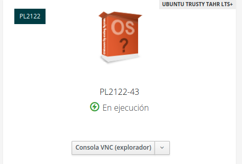
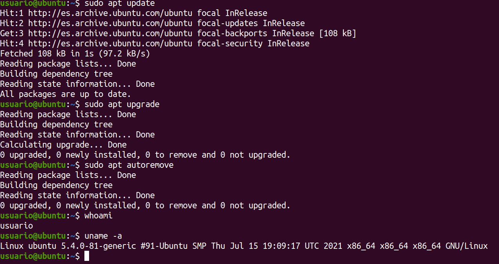

# Práctica: IAAS

Esta práctica tiene por objetivo configurar la máquina personal del *IAAS*.

**Asignatura**: [Procesadores de Lenguajes](https://github.com/ULL-ESIT-PL-2122)

**Alumno**: [Andrés Pérez Castellano](https://github.com/AndPerCast)

## Configuración inicial

### Reclamar una máquina virtual

Primero, acceda a la página del servicio [IAAS](https://iaas.ull.es). Encienda la máquina virtual y<br>
obtenga la dirección *ip* desde el panel de administración.



Dentro de la red universitaria (o usando una *VPN*) conéctese a su máquina remota.
```bash
# Sustituya <ipaddr> por la dirección real
ssh usuario@<ipaddr>
```

Cambie la contraseña por defecto. Actualice el sistema.
```bash
sudo apt update
sudo apt upgrade
sudo apt autoremove
```


