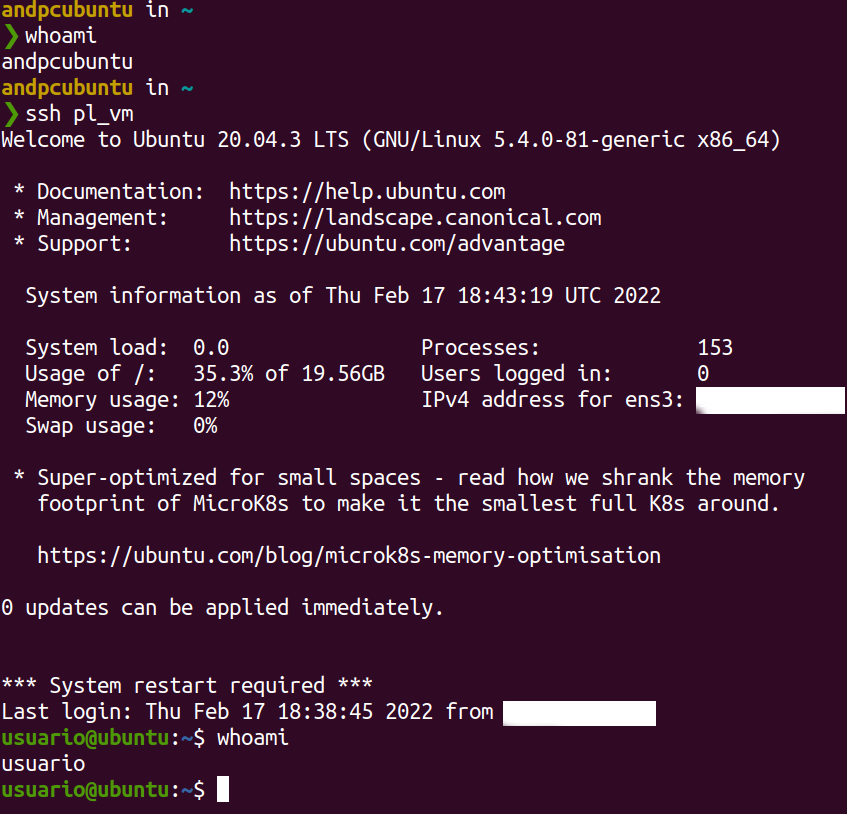
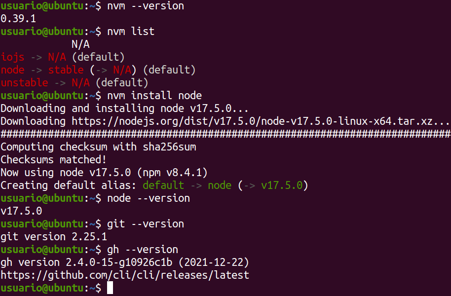
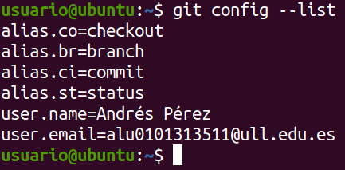
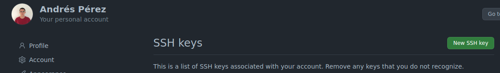
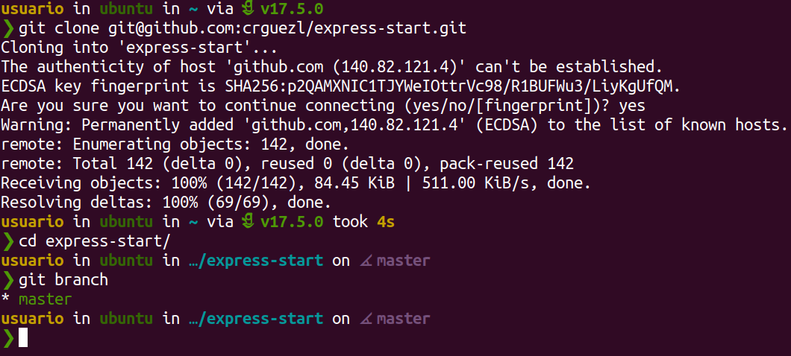
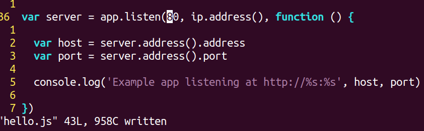
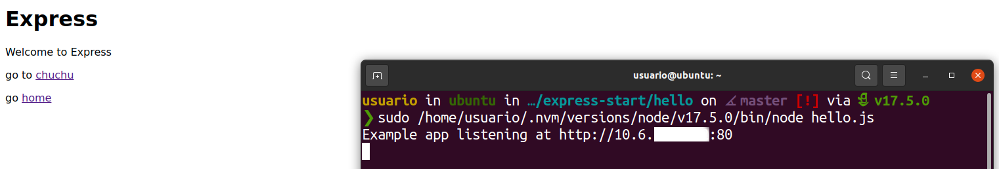

# Práctica: IAAS

Esta práctica tiene por objetivo configurar la máquina personal del *IAAS*.

**Asignatura**: [Procesadores de Lenguajes](https://github.com/ULL-ESIT-PL-2122)

**Alumno**: [Andrés Pérez Castellano](https://github.com/AndPerCast)

<br>

## Configuración inicial

### Reclamar una máquina virtual

Primero, acceda a la página del servicio [IAAS](https://iaas.ull.es). Encienda la máquina virtual y<br>
obtenga la dirección *ip* desde el panel de administración.


Dentro de la red universitaria (o usando una *VPN*) conéctese a su máquina remota.
```bash
# Sustituya <ipaddr> por la dirección real.
ssh usuario@<ipaddr>
```

### Conexión remota

Para simplificar el mecanismo de conexión, haga lo siguiente.

Genere una clave *ssh* en su máquina local.
```bash
ssh-keygen -t rsa
```

Concatene la clave pública `~/.ssh/id_rsa.pub` con aquellas aceptadas en la máquina remota.
```bash
cat .ssh/id_rsa.pub | ssh usuario@<ipaddr> 'cat >> .ssh/authorized_keys'
```

Ahora puede iniciar una sesión remota rápidamente y sin introducir contraseña.



### Actualizar e instalar paquetes

Cambie la contraseña por defecto. Actualice el sistema.
```bash
sudo apt update
sudo apt upgrade
sudo apt autoremove
```


Instale los siguientes paquetes:
- git
- GitHub CLI
- nvm
- nodeJS
- ESLint
- starship prompt



### Git

Configure Git con usuario, email y aliases para operaciones comunes.
```bash
git config --global alias.co checkout
git config --global alias.br branch
git config --global alias.ci commit
git config --global alias.st status
git config --global user.email <email>
git config --global user.name <name>
```



Para poder enlazar repositorios remotos, haga lo siguiente.

Genere una clave *ssh* en su máquina remota.
```bash
ssh-keygen -t rsa
```

Añadala a sus claves de *GitHub*.



### NVM & Node

Mediante el gestor de paquetes [nvm](https://github.com/nvm-sh/nvm), se puede instalar [NodeJS](https://nodejs.org/es/) fácilmente.

```bash
# Instalar nvm con curl.
curl -o- https://raw.githubusercontent.com/nvm-sh/nvm/v0.39.1/install.sh | bash

# Instalar node con nvm.
nvm install node
```

### Shell Prompt

[Starship](https://starship.rs/es-es/) es un prompt para la terminal escrito en *Rust*.<br>
Es muy configurable. Se integra con *git* para reflejar el estado del repositorio.



## Desplegar una aplicación web

Como ejemplo, se usa una aplicación desarrollada en este [repositorio](https://github.com/crguezl/express-start).

Tras clonarlo, se modifica el código servidor para escuchar en el puerto `80`.
```bash
git clone git@github.com:crguezl/express-start.git
cd express-start/hello/
vim hello.js
```



Ahora instale las dependencias del proyecto.
```bash
npm install
```

Ejecute el servidor y acceda a la web en un navegador.

> Note el uso de un puerto privilegiado



